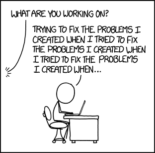

```{r setup, include=FALSE}
knitr::opts_chunk$set(echo = TRUE)
```

Time: 50 min

Description: This session will provide you with advice and skills on how to start tackling error messages and where to look for help.


Errors messages are common when coding and are a way the computer communicates it doesn't understand what the instructions it has been given are.


```{r, echo = FALSE, out.height = '200%', out.width='200%', fig.cap = "https://xkcd.com/1739/"}

```

Some general good advice can be found in https://adv-r.hadley.nz/debugging.html with some specific tips and tricks for R.

# Where do I start?

> Finding your bug is a process of confirming the many things that you believe are true — until you find one which is not true.
> —Norm Matloff


```{r, echo = FALSE, out.height = '200%', out.width='200%'}

```


Rubber Duck debugging

```{r, echo = FALSE, out.width = '200%', out.height = '200%'}

```


## General process

My general process focuses on the initial source of the error and then starts to work backwards in command history.

1. Do I recognise the message?
2. Re-look at the command I ran looking for
    - typos
    - missing syntax (e.g. brackets, semicolons, etc.)
    - correct naming of things
3. Is the input for my command what I expect it is?
4. Did the previous command run properly?
    - if not jump to 1. for the previous command

```{r, echo = FALSE}
knitr::include_graphics("images/debugging/changingstuff.jpg")
```

### Getting to know some errors

Lets look at a few common R errors so that we can become more familiar with a) what they look like, b) how to find the useful bits, and c) demostrate some techniques.

```{r, eval = TRUE, error = TRUE, warning = TRUE}
my_var

mean[2]

a <- c(one = 1,two = 2, three = 3)
a$one

a[[20]]

read.csv("myfile.csv")

ggplot()

notapackage::notafunction()


if(NA){
  print("was NA")
}
```

And examples of warnings

```{r, eva =TRUE, error = TRUE, warning = TRUE}
if(c(3 > c(1,2,3))){
  print("less than three")
}

if(c(1,2,3) > 3){
  print("less than one")
}

mean(c("1", "2"))
```


## Asking/searching for help

- Effective googling
- Stack Overflow
- Minimal Reproducible example
  - https://stackoverflow.com/help/minimal-reproducible-example


## Automated testing

As you code and manually test, it can be beneficial to formalise the manual tests into an automated solution so that you can be more efficient and also ensure that you know when you 'break things' with future changes. This is particularly useful when you fix bugs in your code, create a test that replicates the condition that caused the bug.

In R one system uses the package `testthat` which provides a framework to create these formal tests which will evaluate a piece of code against the known expected output and tell you if they don't match.

```{r, eval = FALSE}

# expect a mean of 2
testthat::expect_equal(mean(c(1,2,3)), 2)

```


