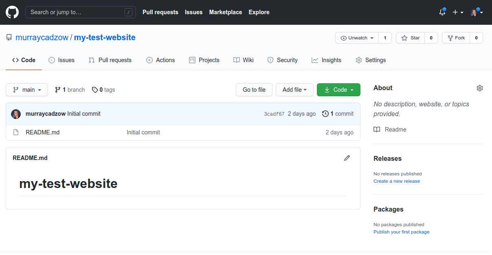
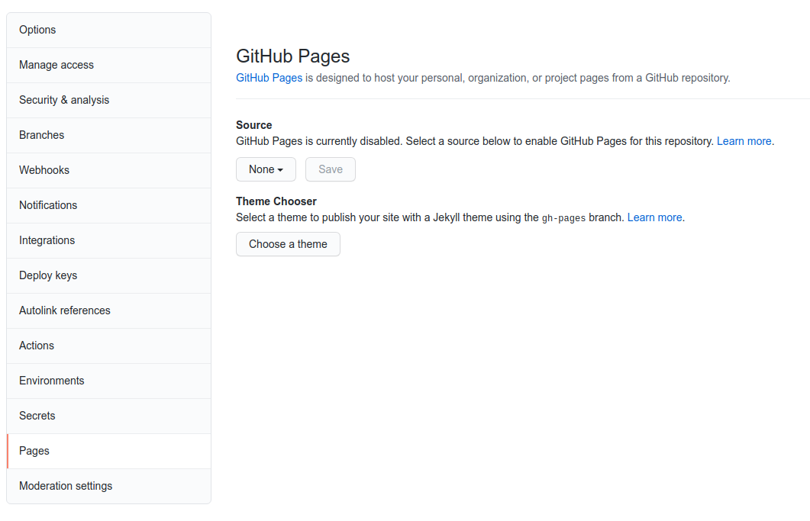
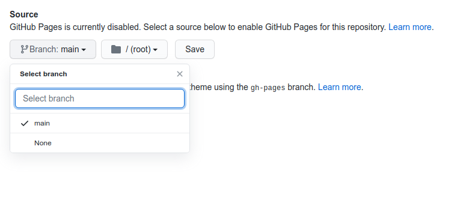
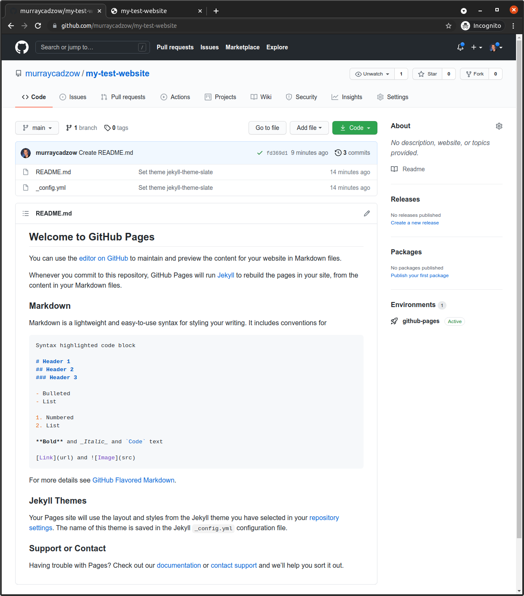
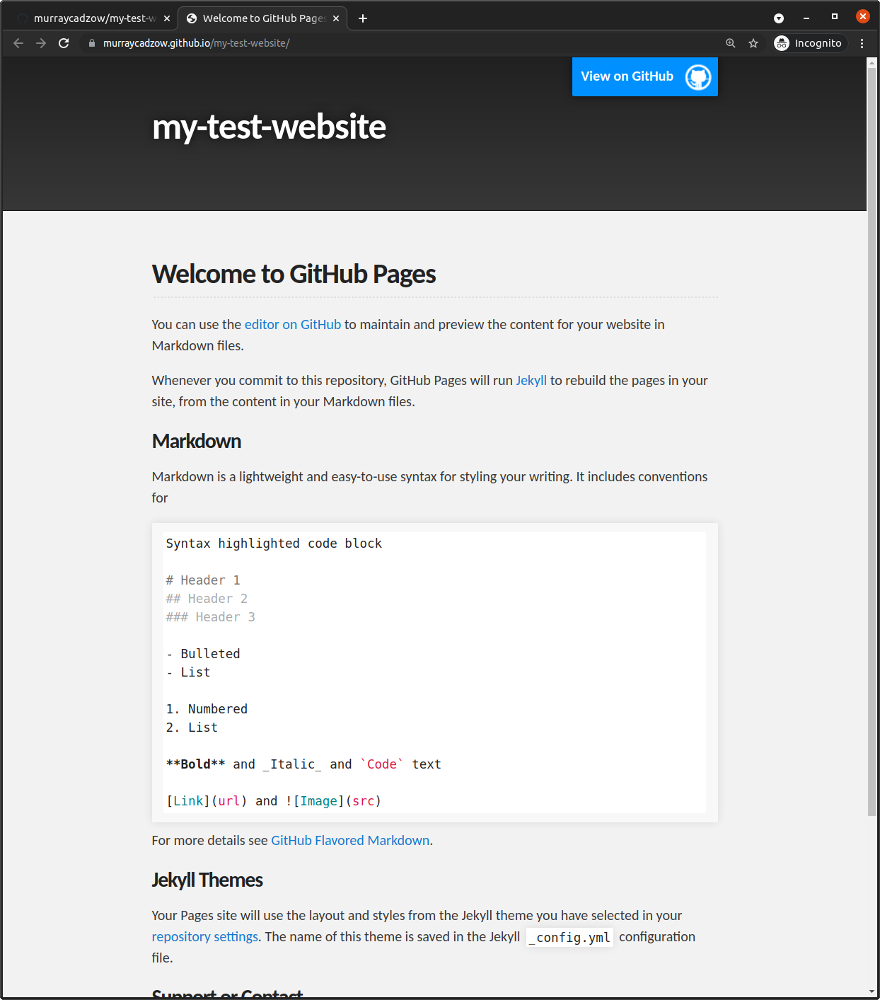

```{r setup, include=FALSE}
knitr::opts_chunk$set(echo = FALSE)
library(knitr)
```


Time: 120 min

Description: This workshop will introduce you to the world of using creating simple websites using the markdown language. A it will involve a practical application of version control principles which can be applied to other code as well.

Creating up a github account
Creating a repository
Introduction to markdown syntax for formatting
Creating a simple webpage with markdown
Modifying pages and tracking changes
How to use Github for collaboration

# Websites with GitHub

Git is a piece of software that manages version control (like track changes in Word) of code in projects known as repositories. GitHub is a website that is used to host these repositories but it also does much more and provides some automation of compiling code - one of these automations was designed to compile web-based languages into websites that could be used to communicate about your repositories. In this workshop, we're going to leverage this automated process from what is known as GitHub Pages in order to create simple websites.

For this workshop, we're going to create two websites, the first is a "sandpit" where we'll introduce how to get a website up and running from scratch. The second, we'll use an existing template for an academic CV that you can then customise.

## Creating a GitHub Account

In order to use GitHub, we need to create an account for ourselves.

1. Open up your web browser and go to [https://github.com](https://github.com)

```{r, echo = FALSE}

```


2. Sign up a GitHub account

3. Sign in to your GitHub account

Now that we're set up with an account, we can start creating our first website

## Website Repository


First we need to create the repository (project) where the code for our website is going to live.

1. Click on the Plus icon in the top left

```{r}

```

2. Select `New Repository`

3. Fill in the details
    - Choose a name for your repository - this will end up as part of the url for your website: e.g. `my-test-website` for me would end up as `https://murraycadzow.github.io/my-test-website`
    - Select `Public`
    - Check `Add a README file`

4. Click `Create Repository`


```{r}

```
5. Create your site

```{r}

```

Click the `Settings` menu (near top right next to the cog)

Then click on the `Pages` link from the left-hand Options menu

```{r}

```

Currently GitHub Pages is disabled so we need to change the source from `None` to `main`. 

```{r}

```
Leave it set to `/ (root)` and click Save. This means that GitHub will take our files we write in markdown and convert them to HTML for us.

GitHub will also tell you the URL that the website is now being published to

```{r}
include_graphics("images/gh_pages/pages_on.png")
```


### Customising

Next we'll pick a theme for our website.

Click the `Choose a theme` button and then browse through the themes in the gallery and select one you like with the `Select theme` button.

You'll then be put in to editing your README.md file which now contains a template text explaining some of the markdown syntax (which we're about to cover next).

Scroll to the bottom and click the green `Commit changes` button

Now click on your repository name at the top left to come back to seeing the contents of your repository

```{r}

```

You'll see two files, the first is the `README.md` which is being displayed, and the second is a file `_config.yml` which contains the configuration information for your website. So far the only configuration is the choice of theme.

I chose the slate theme and now my website looks like this

```{r}

```


### Markdown

GitHub Pages is an automatic system that will convert files written in markdown (commonly with a `.md` file extension) into HTML webpages. Markdown itself is a simplified text based syntax used for styling of writing.

Take a look at the contents of the `README.md` to see some of the syntax we can use to style the text of our website.


## Create a website from a template

- example template: https://academicpages.github.io


### Customising