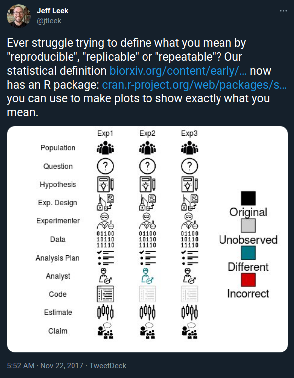

```{r setup, include=FALSE}
knitr::opts_chunk$set(echo = FALSE)
```

Time: 80 mins

Description: This workshop will introduce you to workflow language systems that are used for creating reproducible research workflows. This workshop will use Snakemake as the example

Learning objectives


- Understand principles behind computational reproducibility
- Understand the components of a Snakefile: rules, inputs, outputs, and actions
- Write a simple Snakefile
- Run Snakemake from the shell
- Use Snakemake wildcards to simplify our rules


Setup:

Because it can take a few minutes to install we'll begin by starting the setup process for Snakemake. Please follow the instructions at https://carpentries-incubator.github.io/workflows-snakemake/setup.html

# Workflow languages

## What is a workflow language

Workflows describe the series of steps that need to be performed in order to accomplish a task. A workflow language provides a syntax for us to describe a process and how it relates to other processes.


### Repoducible and Replicatible

```{r, echo = FALSE, fig.align='center'}
knitr::include_graphics("images/the-turing-way-reproducibility-definition.jpg")
```


```{r, echo = FALSE, fig.align='center'}

```


Reproducibility is a strong focus for research. There are varying levels of reproducibility in computational terms, and much of it can be thought of in terms relating to time or location and what differences occur in environment when then change.

- Can I re-run my analysis now on my computer.
- Can I re-run my analysis in the future on my computer?

- Can you re-run my analysis now on your computer?
  - Does my software match yours?
- Can you re-run my analysis in the future?
  - Has the software changed since the last time it was run?

What aspects of the analysis are not affected by change in environment

- What are the steps in the analysis?
- Is the program the same version?
- Is the environment the program is run in the same? (think operating system)

There are different solutions for each level or the reproducibility problem and each adds an extra level of overhead

Commonalities:

- Define 'jobs'
- Define the inputs for a job
- Define the outputs from a job

## Common workflow language

> The Common Workflow Language (CWL) is a standard for describing computational data-analysis workflows. Development of CWL is focused particularly on serving the data-intensive sciences, such as Bioinformatics, Medical Imaging, Astronomy, Physics, and Chemistry. A key goal of the CWL is to allow the creation of a workflow that is portable and thus may be run reproducibly in different computational environments.
> https://en.wikipedia.org/wiki/Common_Workflow_Language

## NextFlow

> Nextflow enables scalable and reproducible scientific workflows using software containers. It allows the adaptation of pipelines written in the most common scripting languages.
> https://www.nextflow.io


Example:

```
#!/usr/bin/env nextflow
 
params.in = "$baseDir/data/sample.fa"
 
/*
 * split a fasta file in multiple files
 */
process splitSequences {
 
    input:
    path 'input.fa' from params.in
 
    output:
    path 'seq_*' into records
 
    """
    awk '/^>/{f="seq_"++d} {print > f}' < input.fa
    """
}
 
/*
 * Simple reverse the sequences
 */
process reverse {
 
    input:
    path x from records
     
    output:
    stdout into result
 
    """
    cat $x | rev
    """
}
 
/*
 * print the channel content
 */
result.subscribe { println it }
```

## Snakemake

> The Snakemake workflow management system is a tool to create reproducible and scalable data analyses. Workflows are described via a human readable, Python based language. They can be seamlessly scaled to server, cluster, grid and cloud environments, without the need to modify the workflow definition. Finally, Snakemake workflows can entail a description of required software, which will be automatically deployed to any execution environment.
> https://snakemake.readthedocs.io/en/stable/

Example:

```
rule bwa_map:
    input:
        "data/genome.fa",
        "data/samples/A.fastq"
    output:
        "mapped_reads/A.bam"
    shell:
        "bwa mem {input} | samtools view -Sb - > {output}"
```

## Example snakemake workflow

We'll now work through the following lessons from this workshop https://carpentries-incubator.github.io/workflows-snakemake/index.html

- Manual Data Processing workflow
- Snakefiles
- Wildcards


